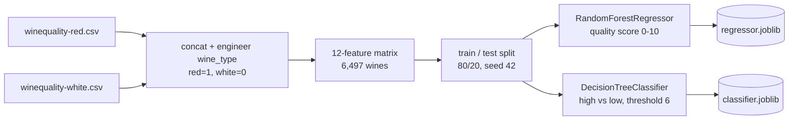
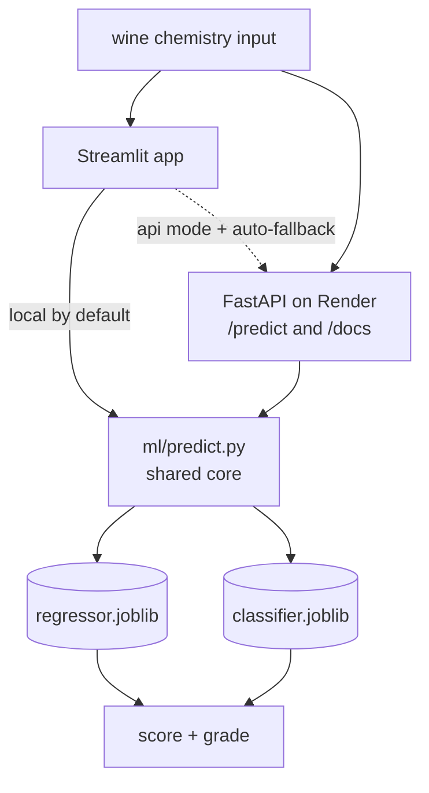

# I gave the same 6,497 wines to two models and asked them different questions

> Draft for dev.to / luisfaria.dev. Suggested tags (dev.to allows 4): `machinelearning` · `python` · `datascience` · `showdev`.

Most ML tutorials stop at a notebook with a green `R²` cell and a shrug. I wanted to
go one step further: take two models I'd actually trained, and turn them into something
you can *poke at* — a typed API and a little web app anyone can open.

So I built **[sommelier-api](https://github.com/lfariabr/sommelier-api)**: one dataset,
two questions, two surfaces.

## Two lenses on the same wine

The [UCI Wine Quality dataset](https://archive.ics.uci.edu/dataset/186/wine+quality)
(Cortez et al., 2009) has 6,497 wines — 1,599 red, 4,898 white — each with 11
physicochemical measurements (acidity, residual sugar, sulphates, alcohol…) and a
quality score from 0 to 10 assigned by human tasters.

You can ask that data two different questions:

1. **How good is this wine?** — a regression problem. Predict the score.
2. **Is this wine good?** — a classification problem. High (≥6) or low (<6)?

Same features, two lenses. I trained one model for each:

- a `RandomForestRegressor` for the score, and
- a tuned `DecisionTreeClassifier` for the grade.

## The modelling (and one honest number)

Both models share the exact same 12 inputs — the 11 chemical readings plus an
engineered `wine_type` flag (red=1, white=0) so a single model can see both colours.
Because both are tree-based, there's **no feature scaling at inference** — one of the
small things that makes serving them clean.

Here's the whole path, from two CSVs to two saved models:



Here's the part most posts skip: **the regressor's R² is about 0.50.** It explains
roughly half the variance in the scores. That's not a bug to hide — it's the nature of
the problem. Wine quality is a *subjective human judgement*; there's a real ceiling on
how well chemistry alone predicts a tasting panel. The classifier does better on its
easier yes/no question — **ROC-AUC ≈ 0.81** — but the honest framing matters more than
a vanity metric. (It's also where the project gets its name: it can bottle about half
the lab; the other half is human.)

What the models *do* agree on is what matters most: **alcohol** and **volatile
acidity** dominate both — high alcohol and low volatile acidity track with better wine.

## Turning models into a service

The interesting engineering isn't the `.fit()` call — it's everything around it. The
repo is built around a **framework-agnostic core** that knows nothing about web
frameworks:

```
ml/
  features.py   # build_features() + FEATURE_ORDER — the single source of truth
  train.py      # deterministic re-train from the raw CSVs -> joblib artifacts
  predict.py    # load_artifacts(), predict_score(), predict_grade()
```

Here's how a prediction actually flows — two adapters, one core:



Everything else is a thin adapter over `ml/`:

- **FastAPI** exposes the models over a typed REST API, **deployed on [Render](https://render.com)**
  with **interactive Swagger docs at `/docs`** you can actually poke — fill in a wine, hit
  *Execute*, watch the prediction come back. Pydantic validates every input (and returns a
  clean `422` when your wine has negative alcohol). `GET /model/info` returns the *real*
  metrics straight from the training run — no hard-coded numbers. It's on the free tier, so
  the first call after a quiet spell takes ~50s to wake the service — an honest tradeoff
  for $0 hosting, and exactly why the Streamlit app doesn't depend on it (below).

```python
@app.post("/predict")
def predict_endpoint(wine: WineFeatures):
    both = predict_both(wine.to_features())
    return PredictResponse(score=both["score"], grade=GradeResponse(**both["grade"]))
```

- **Streamlit** is the friendly face: drag some sliders, hit *Taste it*, watch a gauge
  and a grade badge update. It runs the models **in-process by default** (so the public
  demo never depends on a sleeping backend), but it can flip to calling the live API —
  and if that API is cold, it *falls back to local* automatically and tells you so.

One discipline ties it together: the training scikit-learn version is **pinned**, the
artifacts are committed, and that same version is surfaced at `/model/info`. The joblib
I trained on my laptop is bit-for-bit the joblib that serves in production. No
"works-on-my-machine" drift.

## Try it

- 🍷 **App:** **[sommelier-api.streamlit.app](https://sommelier-api.streamlit.app/)** — paste a wine's chemistry, get both verdicts.
- 📜 **API docs:** **[live Swagger](https://sommelier-api-yd1m.onrender.com/docs)** — the same models over REST.
- 💻 **Code:** [github.com/lfariabr/sommelier-api](https://github.com/lfariabr/sommelier-api)

## What's next — and what's *not* worth it

v1 was about the full path from notebook to deployed service, not a perfect model. From
here there's a real roadmap — but a good roadmap also says *no*. Here's how I'd weigh the
obvious next steps:

| Next step | Worth it? | Why |
|---|---|---|
| **Log predictions to a DB** (SQLite → Postgres) | ✅ soon | Cheapest high-value add — a usage log gives analytics, drift monitoring, and a real-world dataset. SQLite is plenty to start. |
| **More / better data** (other wine datasets & APIs) | ✅ highest leverage | The R² ceiling here is *data*-bound, not model-bound. More wines and richer features (price, region, vintage) beat any fancier algorithm. |
| **SHAP explanations** | ✅ yes | Let the app say *why* a wine scored low — turns the black box into a teaching tool for a few lines of code. |
| **Gradient boosting + probability calibration** | ✅ quick win | XGBoost/LightGBM usually edge out a random forest on tabular data; calibration makes a "73%" actually mean 73%. |
| **Rate limiting** (e.g. slowapi) | ⚠️ once it has traffic | A public API needs it eventually to curb abuse and protect the free tier — but premature on day one. |
| **Redis** | ⚠️ pairs with the above | Earns its keep only behind rate-limit counters or a cache shared across instances. Overkill for a single free dyno today. |
| **Deep learning** | ⚠️ for learning, not accuracy | On ~6,500 rows of tabular data, trees almost always beat neural nets. A great DL *exercise* — not a way to move the metric. |
| **Auth + freemium** (5 free, then sign in) | ⚠️ only if productizing | Adds friction to a demo whose whole point is "try it instantly". Makes sense only if this becomes a real product. |
| **More engineered features** | ⚠️ limited upside | The 11 chemical inputs are largely tapped out; interaction terms are cheap to try but won't break the data ceiling. |
| **Email (Resend)** | ❌ not yet | No natural trigger — no accounts, no reports to send. A tool looking for a problem until a feature needs one. |

The thread through that table: **more/better data and explainability beat fancier
infrastructure.** The point of v1 wasn't the perfect model — it was the full path from a
notebook to a deployed, typed, tested service. The half you can bottle.

## References & code

- **Dataset** — P. Cortez, A. Cerdeira, F. Almeida, T. Matos, J. Reis. *Modeling wine
  preferences by data mining from physicochemical properties.* Decision Support Systems
  47(4), 547–553 (2009). [UCI Wine Quality](https://archive.ics.uci.edu/dataset/186/wine+quality).
- **Code** — [github.com/lfariabr/sommelier-api](https://github.com/lfariabr/sommelier-api):
  the full serving layer, re-implemented from the public CSVs.
- The two models originate in my Master of Software Engineering (AI) coursework
  (MLN601 — regression + classification).
